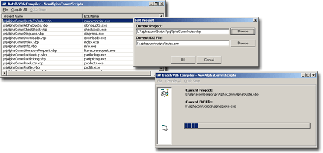



## A1 \- VB6 Project BATCH COMPILER

### Description

This application allows you to create Batch Compile Profiles for different projects. Add all of your VB Projects to a profile, and watch thtem compile (using the project's compile information) automatically. I am involved in a project which uses VB to produce over 50 WEB-EXEs for a website. When I want to change 1 thing in the header, I used to have to re-compile all 50+ EXE files by hand. NO MORE. Simply Drag-n-Drop your projects in this application and watch them go!
 
### More Info
 

             |
---                |---
**Submitted On**   |2005-03-24 10:38:48
**By**             |[\[\]\)utch\[\]v\[\]aster](https://github.com/Planet-Source-Code/PSCIndex/blob/master/ByAuthor/utch-v-aster.md)
**Level**          |Intermediate
**User Rating**    |5.0 (20 globes from 4 users)
**Compatibility**  |VB 6\.0
**Category**       |[Complete Applications](https://github.com/Planet-Source-Code/PSCIndex/blob/master/ByCategory/complete-applications__1-27.md)
**World**          |[Visual Basic](https://github.com/Planet-Source-Code/PSCIndex/blob/master/ByWorld/visual-basic.md)
**Archive File**   |[A1\_\-\_VB6\_P1867483242005\.zip](https://github.com/Planet-Source-Code/utch-v-aster-a1-vb6-project-batch-compiler__1-59615/archive/master.zip)

